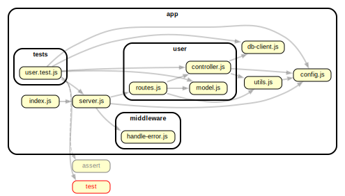

# Basic Auth Back End

This uses Redis to store the username and password. It is a very simple example of how to use Redis with Express. That means you'll need Redis installed and running.

## Install and Start Redis

```bash
brew install redis

# Start Redis and use the provided configuration file
redis-server ./redis.conf
```

❗ Leave this 🏃🏾‍♂️ running in a separate terminal window. With [Warp terminal](https://www.warp.dev/), you can use `⌘T` to open a new tab.

> The open source, in-memory data store used by millions of developers as a database, cache, and message broker.
> [https://redis.io/](https://redis.io/)

## Create a `.env` file

`touch .env`. This will create a file in the root of the project (assuming that that's where you ran it from). Then, add the following: `JWT_SECRET='SECRET!'`. This is the secret that will be used to sign the JWTs. It's required by [./app/config.js](./app/config.js).

## Install and Start the Server

```bash
npm install
node app/index.js
```

Again, do this in a separate terminal window. We need Redis running to have a database for this Node/Express server to talk to.

Furthermore, you'll need additional terminal windows to run whatever front-ends, etc.

## Questions?

Ask in Slack ASAP!

---


